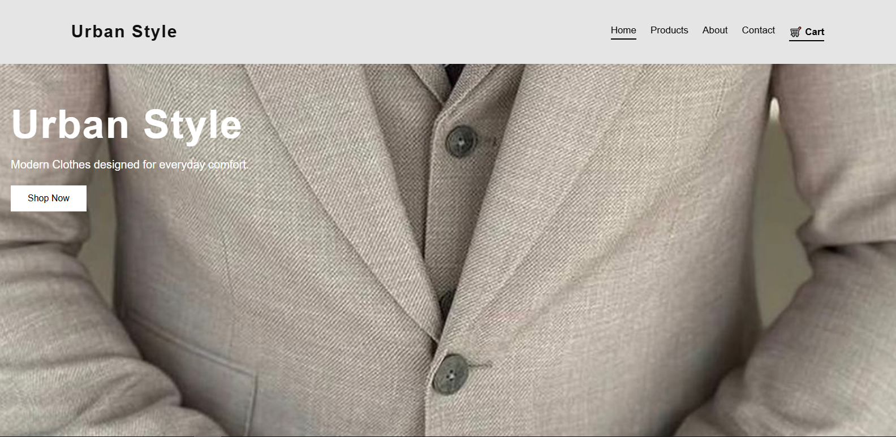
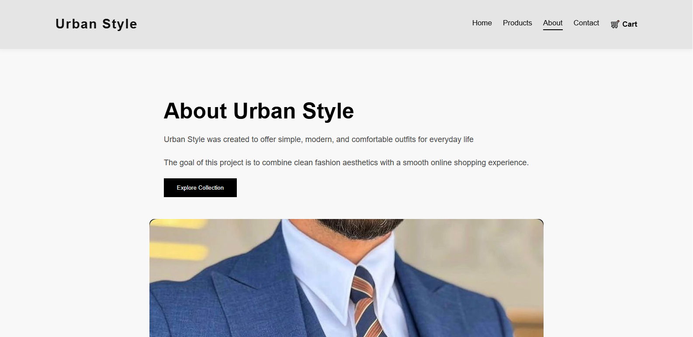
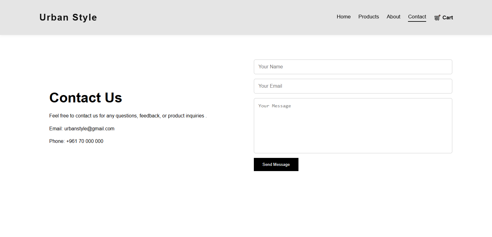

# Urban Style

## project description 

Urban Style is a responsive fashion store website developed using reactJS.The project focuses on creating a clean and  modern user interface for browsing clothing products online.

## Features

- Responsive design for desktop and mobile
- Product categories and filtering
- Product search functionality
- Modern homepage with featured collection
- Customer feedback section
- Contact form UI/UX design
- React Router navigation

## Technologies Used

- ReactJS
- CSS
- JavaScript
- React Router
- Vite
- Git & Github 
- netlify deployment  

## Pages

- Home
- Products
- About
- Contact

## Project Structure

src/
- assets/
- components/
- data/
- pages/
- App.jsx
- main.jsx
- style.css

## Setup Instructions

1. Clone the repository

Github link : https://github.com/mohammadqassem515-lab/urban-style-#

2. Netlify link ( deployment) : https://urban-style-mohamad-adnan.netlify.app/

## Screen shots 

